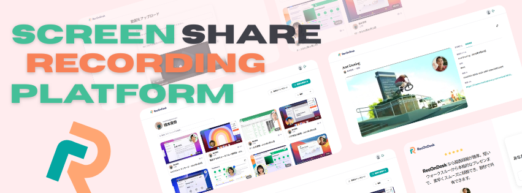
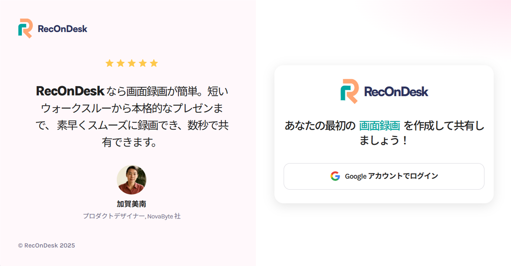
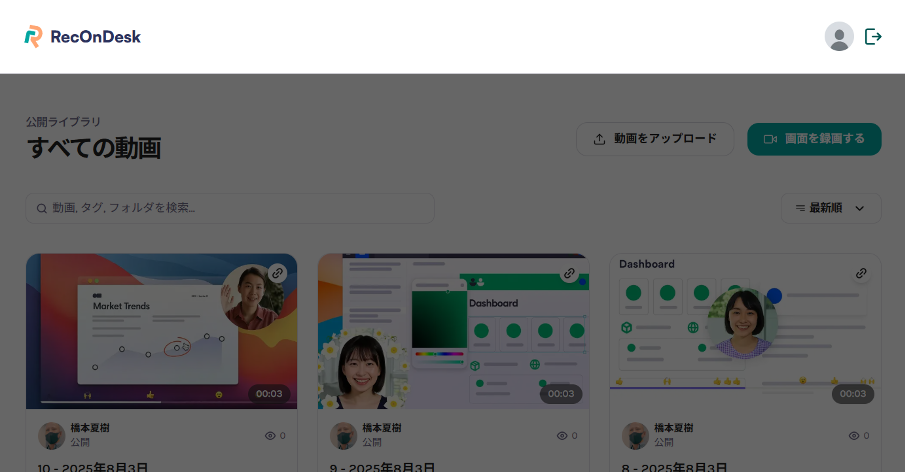
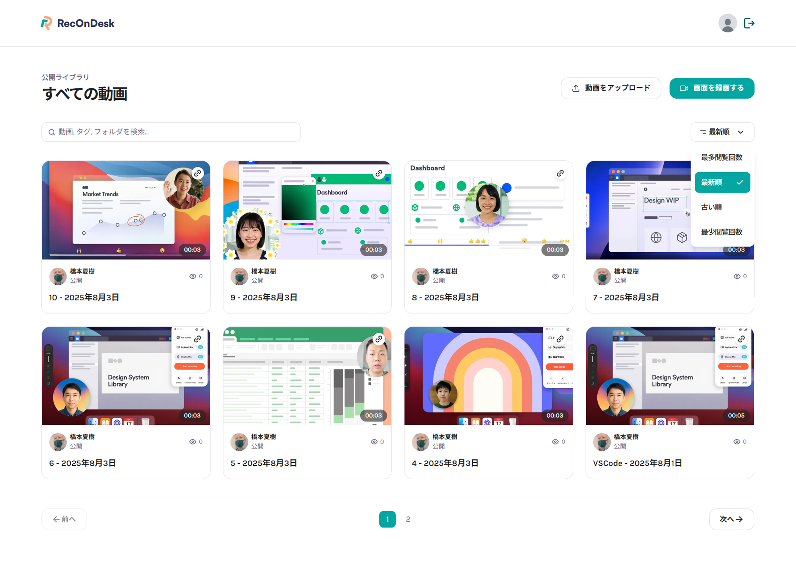
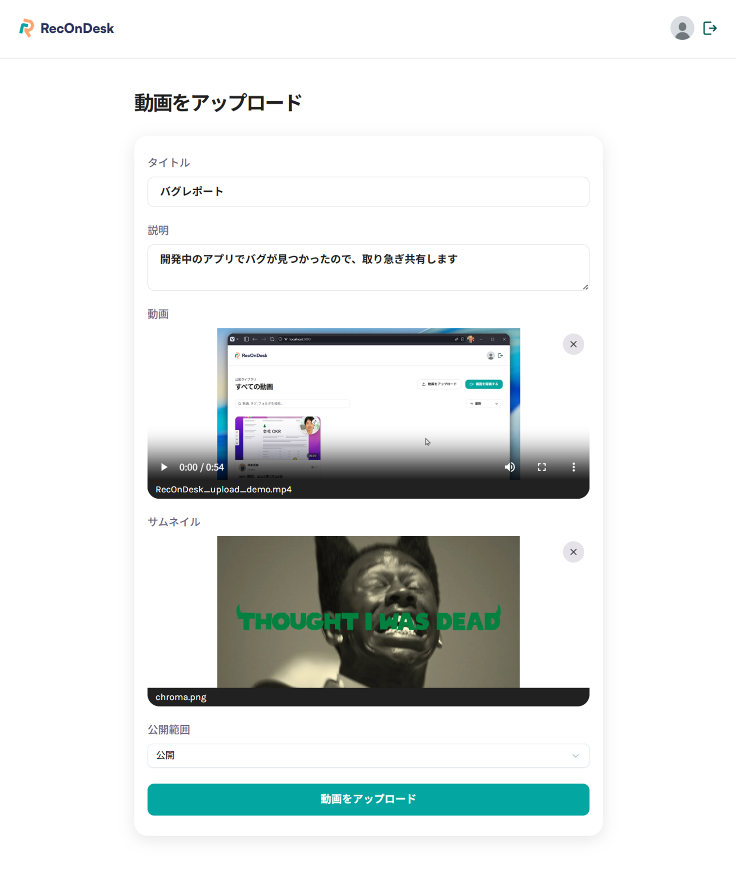
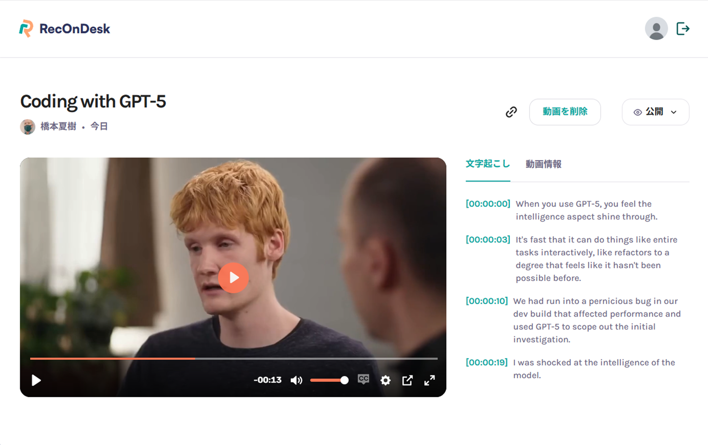
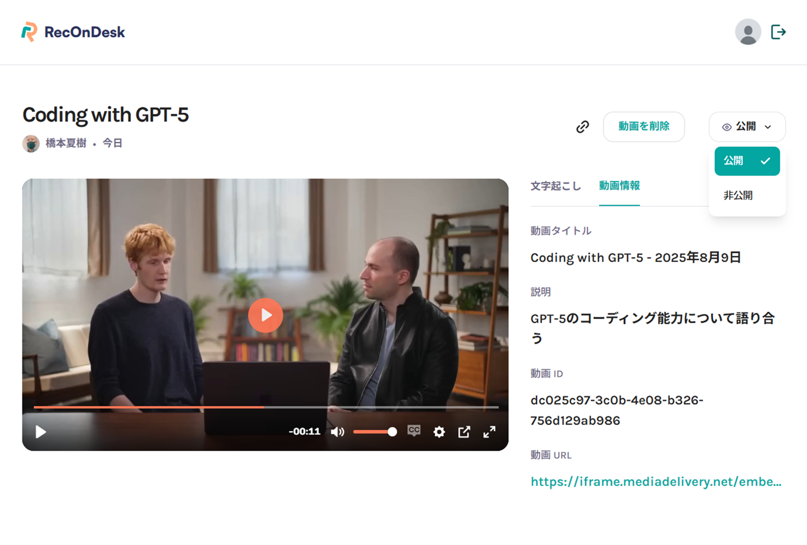

  

    
    
    
    
    
    
    
    
    
    
    
    
    
  

  <h3 align="center">SCREEN SHARE RECORDING PLATFORM</h3>

  

    デスクトップ画面録画共有プラットフォーム
  

## 📋 <a name="table">もくじ</a>

1. 🤖 [はじめに](#intro)
2. 🔗 [URL](#url)
3. 😮‍💨 [RecOnDesk の概要](#description)
4. 🔋 [画面録画共有プラットフォームの機能](#feature)
5. 🚀 [アプリの利用サンプル](#example)
6. 💻 [画面サンプル](#screen_sample)
7. 🤸 [終わりに](#outro)

## <a name="intro">🤖 はじめに</a>

デスクトップ画面を手軽に録画し、チームメンバと録画動画をリンク共有できるプラットフォーム **RecOnDesk** をご紹介します。

## <a name="url">🔗 URL</a>

RecOnDesk | SCREEN SHARE RECORDING PLATFORM  
https://recondesk.vercel.app

---

## <a name="description">😮‍💨 RecOnDesk の概要</a>

画面録画ソフトと格闘している時間の方が、実際に録画している時間よりも長くなったことはありませんか？

複雑なメニューや設定に時間を取られ、ただサッとデモを録画したいだけなのに、思うようにいかない。

--

**RecOnDesk（レコンデスク）** は、「録画」ボタンを押して、画面をキャプチャして、すぐに共有リンクを発行できるプラットフォームです。

おもな特徴や機能は以下の通りです。

### おもな特徴

#### 🥳 Google 認証を用いた認証機能

誰でも簡単にアカウントを作れる Google アカウントの認証があることで、手軽にプラットフォームにアクセスすることができます。

#### 👯 デスクトップまたはブラウザのワンクリック録画

ボタンのワンクリックで、指定のデスクトップ、ブラウザ、ウィンドウを録画開始しすることができます。

#### 💾 即時アップロード（公開・非公開の切り替え付き）

録画した動画は、その場でアップロードを行うことができます。
アップロードした動画を公開するか、非公開にするかは、いつでも切り替えることができます。

#### 自動生成される共有リンク

動画をアップロードすると、他のユーザと動画を共有するためにリンクが自動で生成されます。

#### AI による音声文字起こしとタイムスタンプ付きの字幕表示

アップロードした動画対してバックグラウンドで処理が行われ、AI による音声の文字起こしと、文字起こしに付随してタイムライン上の再生時刻が表示されます。

#### 動画を整理できるフィルター・ソート付きのギャラリー

プラットフォームの動画一覧画面では、検索フォームやフィルターが付属しています。
キーワード検索をしたり、投稿の古い順、新しい順、再生数の多い順などで動画の並び替えを行うことも可能です。  

#### スパムやボット対策を備えたセキュリティ

一定時間内にクライアントが実行できるリクエストの数を制限しています。
それにより、スパムやボットを目的とするユーザの利用を防いでいます。

#### 🔨 技術的背景

フロントエンドと API は、Next.js を使った Web アプリ構成です。

画面からのユーザ操作により、エッジホスティングに動画をアップロードし、データベースに登録した情報から、プラットフォーム上にアップロードした動画を提供します。

* **Next.js**：スケーラブルでパフォーマンスの高いサーバー駆動型サイトを構築するためのフレームワーク
* **Tailwind CSS**：ユーティリティファーストなスタイリングで、レスポンシブな UI を構築
* **Better Auth**：TypeScript ネイティブで、簡単かつセキュアな認証を実現
* **Xata（PostgreSQL プラットフォーム）** + **Drizzle ORM**：完全な型安全性を備えたデータベース操作
* **TypeScript**：コードベース全体の保守性を高める
* **Bunny.net**：エッジ配信プラットフォーム。動画ホスティング・エンコード・字幕生成などを数分で実現
* **Arcjet**：ボット保護、レート制限をコードベースで管理できるセキュリティサービス

#### まとめ

**RecOnDesk（レコンデスク）** は、その場で画面録画、アップロード、共有が手軽にできるプラットフォームです。

---

## <a name="feature">🔋 画面録画共有プラットフォームの機能</a>

### 🏠 ログインページ

- 🗝️ Google ログイン

### ヘッダナビゲーション

- サイトロゴ
- プロフィールボタン
- 🔐 ログアウトボタン

### 📡 動画一覧

- キーワード検索
- 閲覧回数順、アップロード日時順の検索結果並び替え
- ページネーション
- 動画アップロードボタン
- 画面録画ボタン

### 🤖 画面録画モーダル

- 画面録画開始ボタン
- タブ/ウィンドウ/画面選択
- 画面録画停止ボタン
- 録画再開ボタン
- アップロード続行ボタン

### アップロード画面

- タイトル入力フォーム
- 説明入力フォーム
- 動画アップロードフォーム
- サムネイルアップロードフォーム
- 公開設定（公開/非公開）選択ボックス
- アップロードボタン

### 🌐 個別動画ページ

- 動画再生
- 文字起こしタブ
- 動画情報タブ
- アップロードユーザー情報（アバター/ユーザー名）
- アップロード日時（何日前）
- 動画共有リンクコピーボタン
- 動画削除ボタン
- 動画公開設定切替ボタン

### 🌐 プロフィールページ

- ユーザアバター
- メールアドレス
- ユーザー名
- アップロード済み動画一覧

---

## <a name="example">🚀 アプリの利用サンプル</a>

### 📱 使い方（3ステップ）
1. **録画**：ワンクリックで画面録画開始
2. **アップロード**：録画完了後、即座にクラウドへ
3. **共有**：自動生成されたリンクを取得

##### 検索デモ
<!-- ./images/recondesk_search_demo.mp4 -->
<video src="https://github.com/user-attachments/assets/bb871b36-1e2c-46a7-b845-0d1a5a201c91" controls="true"></video>

##### 画面録画デモ
<!-- ./images/recondesk_recording_demo.mp4 -->
<video src="https://github.com/user-attachments/assets/d4dd478f-388c-42bc-94b1-fe6aba52b499" controls="true"></video>

##### アップロード / 共有デモ
<!-- ./images/recondesk_upload_demo.mp4 -->
<video src="https://github.com/user-attachments/assets/4eb3e95e-9a6a-48a4-8c54-b8ae3b02c83b" controls="true"></video>

---

## <a name="screen_sample">💻 画面サンプル</a>

### ログインページ

#### 🗝️ Google ログイン

---

### ヘッダナビゲーション

- サイトロゴ
- プロフィールボタン
- 🔐 ログアウトボタン

---

### 動画一覧

- キーワード検索
- 閲覧回数順、アップロード日時順の検索結果並び替え
- ページネーション
- 動画アップロードボタン
- 画面録画ボタン

---

### アップロード画面

- タイトル入力フォーム
- 説明入力フォーム
- 動画アップロードフォーム
- サムネイルアップロードフォーム
- 公開設定（公開/非公開）選択ボックス
- アップロードボタン

---

### 🌐 個別動画ページ

- 動画再生
- 文字起こしタブ
- 動画情報タブ
- アップロードユーザー情報（アバター/ユーザー名）
- アップロード日時（何日前）
- 動画共有リンクコピーボタン
- 動画削除ボタン
- 動画公開設定切替ボタン

#### 文字起こしタブ

#### 動画情報タブ

---

### 🌐 プロフィールページ

- ユーザアバター
- メールアドレス
- ユーザー名
- アップロード済み動画一覧

---

## <a name="outro">🤸 おわりに</a>

今回は、Next.js と Bunny.net、Better Auth、Arcjet などの最新技術スタックを組み合わせることで、誰でも手軽に画面録画から動画共有まで完結できるプラットフォーム **RecOnDesk** を作成しました。

複雑な録画ソフトの設定に悩まされることなく、「録画」→「アップロード」→「共有」をシームレスに行えることで、チーム内のコミュニケーション効率を大幅に向上させます。

**こんな方におすすめ：**
- バグレポートや操作手順を視覚的に共有したい開発者
- プロダクトデモや機能説明を手軽に作成したいプロダクトマネージャー
- リモートワークでの画面共有やオンボーディング資料を効率化したいチーム

AI による自動文字起こし機能により、動画内容の検索性も向上し、後から必要な情報を素早く見つけることができます。

将来的には、リアルタイム配信機能や動画編集機能、チーム管理機能など、よりコラボレーションを重視した機能拡張も検討中です。

RecOnDesk で、あなたのチームの画面共有体験を革新してみませんか？